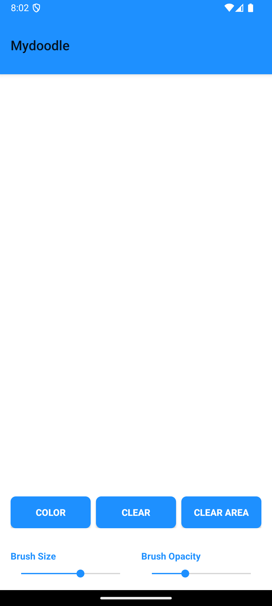

# android-doodle-app
This repository contains an Android-based doodling application that allows users to draw on a canvas with customizable brush settings such as brush size, color, and opacity. The tool panel for customization is located at the bottom of the screen for easy access.

## Features: 
* Full-screen doodling canvas.

* Tool panel with buttons for brush size, color selection, opacity adjustment, and clearing the canvas.

* Adjustable brush size using a seek bar in a dialog.

* Color selection (currently supports a simple predefined color selection).

* Adjustable opacity for brush strokes.

## How to Run the Application

### Prerequisites

1. Android Studio installed on your computer.

2. Java Development Kit (JDK 8 or higher).

3. An Android device or emulator for testing.

### Steps to Run

1. #### Clone the Repository:

git clone https://github.com/saul-alzahrani/android-doodle-app.git

2. #### Open in Android Studio:

* Launch Android Studio.

* Select Open an existing Android Studio project.

* Navigate to the cloned repository and select the project folder.

2. #### Build the Project:

* Let Android Studio sync and build the project.

* Ensure all Gradle dependencies are installed properly.

3. #### Run the Application:

* Connect an Android device via USB, or start an emulator.

* Click the Run button (green play icon) in Android Studio.

* Choose the connected device or emulator to run the application.

## References

#### This project was built using the following online resources:
1. https://dragosholban.com/2018/04/21/how-to-build-a-drawing-android-app/
2. http://android-er.blogspot.com/2015/02/set-opacity-alpha-of-imageview-and.html
3. https://developer.android.com/develop/ui/views/components/appbar/setting-up
4. https://abhiandroid.com/ui/button#gsc.tab=0
5. https://medium.com/@mihirrshah02/make-a-drawing-app-in-android-6a36edf21bc9
6. https://youtu.be/5BzYH6Vq6ZU?si=d3WcOkO4bw2640P5
7. https://www.youtube.com/watch?v=AM6lJnze9nA
   
